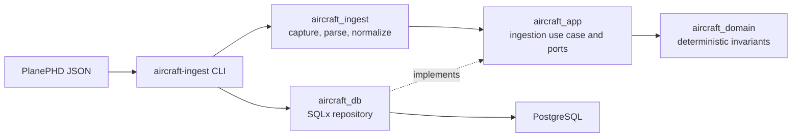

# Aircraft Management Engine

Aircraft Management Engine is a Rust 2024 and PostgreSQL backend under active
development for storing, curating, searching, and comparing aircraft data. The
target system uses hexagonal architecture, Axum at the HTTP boundary, SQLx at
the persistence boundary, and SQL-first migrations as the canonical database
history.

The project treats provenance, source assertions, measurement conditions, and
curation status as first-class data. Imported values do not become canonical
simply because they were parsed successfully.

> [!IMPORTANT]
> This repository is an incomplete restructuring branch, not a production
> server. The PlanePHD ingestion vertical slice, the ordered database schema,
> and several repository automation commands are implemented. The Axum API
> currently contains only a health contract. `apps/server` boots and serves that
> contract over HTTP and builds a verified database pool, but has no readiness
> route, graceful shutdown, or perimeter limits. Search, comparison, and authentication are not
> implemented end to end. The Rust ingestion path
> passed all six deployment gates, including the SQL-versus-Rust parity run that
> justified retiring the legacy loader; that gate is now a golden-snapshot
> regression check. Run them with `just test` and `just snapshots`. Ingested measurements stay pending until a
> curator accepts them with `just curate-accept`.

## Goals

- Preserve aircraft identity, specifications, provenance, and curation history.
- Import untrusted source data through explicit validation and normalization
  boundaries.
- Keep source claims separate from reviewed canonical aircraft data.
- Support aircraft search and comparison without losing units or measurement
  conditions.
- Keep domain behavior independent of HTTP, PostgreSQL, configuration, and
  telemetry frameworks.
- Provide repeatable SQL-first migration, seed, and validation workflows.
- Make imports auditable, idempotent, bounded, and recoverable after failure.

## Current status

| Area | Status |
|---|---|
| Rust workspace | Cargo resolves eleven packages around the ingestion slice, the HTTP server, shared libraries, API contract generation, test support, and `xtask` |
| Database | The canonical migrations under `database/migrations/`, checksum-locked history, dependency-aware installation, reference seeds, and SQL validation scripts are present |
| Rust ingestion CLI | `validate`, `import`, `status`, and `curate` (`list`, `accept`, `reject`, `refresh`) are implemented for PlanePHD JSON |
| Ingestion semantics | Immutable input capture, SHA-256 identity, bounded streaming, preflight validation, transactional promotion, audit history, and idempotent replay are implemented |
| Persistence | SQLx ingestion repository implemented; the broader repository surface remains incomplete |
| Domain and application | Ingestion rules and orchestration are implemented; most general aircraft, mission, search, and comparison behavior remains scaffolded |
| HTTP API | Axum health route and generated OpenAPI contract only; no product routes, readiness route, or perimeter limits |
| Server | Runnable Axum server in the workspace; it serves health and builds a verified, bounded database pool, but has no graceful shutdown and no route reads from the pool |
| Repository automation | Boundaries, migration policy, OpenAPI compatibility, dependency review, supply-chain policy, workflow linting, secret scanning, CodeQL, and ingestion golden snapshots are enforced locally or in CI |
| Tests | Meaningful unit, application, property, repository, and disposable-PostgreSQL ingestion tests. The three placeholder files under `tests/` were deleted; that directory now holds only fixtures |
| Production readiness | Not ready; target-environment gates remain, and the authenticated HTTP product is incomplete |

### What works today

The `aircraft-ingest` binary can:

- read PlanePHD JSON from a file or standard input;
- enforce a configurable input-size limit while copying bytes to an owner-only
  temporary artifact;
- compute a SHA-256 identity over the exact input;
- validate every record before opening the import transaction;
- normalize supported identity, measurement, propulsion, market, and cost data;
- preserve raw JSON and emit stable issues for uncertain or unsupported values;
- stream prepared records through a bounded channel;
- import through a dedicated SQLx repository in one PostgreSQL transaction;
- retain durable run and attempt history, including validation and transaction
  failures;
- recognize a successfully imported source/hash/parser identity as an
  idempotent replay; and
- report status in human-readable or versioned JSON form.

The database tree provides the ordered schema, canonical seed data, transient
staging logic, test fixtures, role grants, and post-install validation. The
installer records applied versions in `public.aircraft_schema_migrations` and
places required seed phases at their foreign-key boundaries.

## Architecture

The implemented ingestion path follows the intended inward dependency
direction:



The target HTTP path is:

```text
Axum API adapter -> application use cases -> domain
database adapter -> application ports / domain
server -> configuration + telemetry + database + API composition
```

The layer responsibilities are:

- `aircraft_domain`: deterministic entities, value objects, units, and business
  invariants with no HTTP, SQLx, Tokio, configuration, or telemetry dependency.
- `aircraft_app`: use cases and ports. It coordinates domain behavior without
  depending on HTTP DTOs or concrete database repositories.
- `aircraft_api`: Axum requests, responses, status mapping, middleware, and
  OpenAPI definitions. It must not issue SQL.
- `aircraft_db`: SQLx repositories and explicit database-row/domain mappings.
- `aircraft_ingest`: source capture, parsing, validation, normalization, and
  source-specific failure reporting.
- `aircraft_config`: typed configuration, including secret-protected database
  URLs.
- `aircraft_observability`: structured tracing initialization.
- `apps/server`: the runtime composition root. Loads settings, initializes
  tracing, builds the database pool, binds a listener, and serves
  `aircraft_api::router()`. The pool is held for the lifetime of the process;
  no route reads from it yet.

HTTP DTOs, application inputs, domain values, and database rows are separate
representations. Boundary conversions should remain explicit as the system is
completed.

## Ingestion processing model

```text
capture immutable input and compute SHA-256
  -> preflight the complete artifact
  -> open a bounded prepared-record stream
  -> acquire the logical-import advisory lock
  -> stage and promote records transactionally
  -> preserve provenance, assertions, and curation flags
  -> refresh the read model
  -> commit the import and its audit result
```

Logical import identity is:

```text
source slug + content SHA-256 + parser name + parser version
```

A successful replay returns the existing report instead of creating duplicate
aircraft data. A hard import failure rolls back staged and promoted aircraft
data while recording the failed attempt separately.

PlanePHD measurements and assertions are intentionally imported as pending and
non-canonical. They remain outside the canonical search read model until a
curation workflow accepts them.

See [Rust ingestion adapter](docs/architecture/rust_ingestion_adapter.md) for
the complete mapping, transaction, exit-code, Aiven-role, and retirement
contracts.

## Repository structure

```text
aircraft-api-r/
├── apps/
│   ├── ingest/                 # Working ingestion CLI composition root
│   └── server/                 # Excluded legacy source; target server root
├── crates/
│   ├── aircraft_api/           # Minimal Axum health/OpenAPI contract
│   ├── aircraft_app/           # Use cases and ports; ingestion is implemented
│   ├── aircraft_config/        # Typed configuration
│   ├── aircraft_db/            # SQLx persistence; ingestion is implemented
│   ├── aircraft_domain/        # Pure rules; ingestion invariants implemented
│   ├── aircraft_ingest/        # PlanePHD capture, parsing, and normalization
│   ├── aircraft_observability/ # Tracing setup
│   └── aircraft_testsupport/   # Disposable PostgreSQL integration harness
├── database/
│   ├── migrations/             # Canonical ordered schema history
│   ├── seeds/                  # Canonical reference and mission-profile data
│   ├── snapshots/              # Snapshot queries and committed golden output
│   ├── validation/             # Post-install schema and behavior checks
│   ├── fixtures/               # Test-only database data
│   └── roles/                  # Restricted ingestion-role grants
├── docs/architecture/          # Architecture and boundary documentation
├── tests/fixtures/             # Source fixtures used by Rust integration tests
├── xtask/                      # Tested repository automation
├── Cargo.toml
└── justfile
```

`archive/` contains restructure snapshots and retired template-derived code. It
is reference material and is not part of the active implementation. Its
manifests are kept as `Cargo.toml.retired`, matching the existing
`Cargo.toml.before` and `Cargo.toml.proposed` snapshots, so that the retired
dependencies they record are not read as requirements of this workspace.

## Development environment

Required local tools are:

- Rust 1.85 or newer with Cargo, rustfmt, and Clippy;
- Docker with the Compose plugin;
- PostgreSQL client tools;
- Node.js with npm for pinned OpenAPI and migration linters;
- Just; and
- cargo-nextest for `just test`.

`just lint` additionally requires cargo-audit and cargo-deny. The SQLx CLI is
managed as a development dependency but offline query metadata is not yet part
of the implemented repository workflow.

Create a local ignored environment file before using Just recipes:

```bash
cp .env.example .env
```

The values in `.env.example` and `docker-compose.yml` are local-development
defaults, not production credentials.

Check the environment without installing anything:

```bash
just install-deps --check
```

Run `just install-deps` only if you want the repository automation to install
missing Rust development tools. Platform prerequisites such as Docker and the
PostgreSQL client must be installed separately.

## Validate source data without PostgreSQL

The checked-in synthetic fixture exercises the PlanePHD boundary:

```bash
just ingest-validate tests/fixtures/planephd_minimal.json
```

The binary also accepts standard input and JSON output directly:

```bash
cargo run --package aircraft-ingest -- \
  validate \
  --source planephd \
  --input - \
  --format json
```

Validation captures and parses the artifact but does not connect to PostgreSQL.

## Run the local database workflow

Inspect the resolved Compose configuration before changing local infrastructure:

```bash
just compose-config
just compose-services
```

For an isolated local database, start PostgreSQL, install the canonical schema,
and run the SQL validation suite:

```bash
just db-bootstrap
```

Then import the fixture and inspect the audit history:

```bash
just ingest-import tests/fixtures/planephd_minimal.json
just ingest-status --limit 20
just ingest-status-json --limit 20
```

Import and status require `APP__INGEST__DATABASE_URL`. The ingestion database
URL is read from configuration and is never accepted as a command-line
argument.

If a committed curation decision reports that its read-model refresh is queued,
retry the outstanding refresh with the implemented CLI command:

```bash
just curate-refresh
```

> [!WARNING]
> `just db-reset` deletes the local Compose PostgreSQL volume and starts an
> empty database. `just db-rebuild` performs the destructive reset and then
> installs and validates the schema. Do not run either command when local data
> must be preserved.

The legacy server-side SQL loader has been retired. `cargo xtask snapshots`
(`just snapshots`) now imports each fixture through the Rust adapter and diffs the
result against committed golden snapshots in `database/snapshots/golden/`.

## Configuration

Settings use the `APP` prefix and `__` for nesting. Sources are read lowest
precedence first: built-in defaults, then `config/defaults.json5`, then
`config/config.json5`, then the environment. Neither override file is required,
and neither is checked in.

Server settings:

| Variable | Purpose |
|---|---|
| `APP__HTTP__HOST` | Bind host; defaults to `127.0.0.1`, and must not be blank |
| `APP__HTTP__PORT` | Bind port; defaults to `8080`, and must be 1-65535. Zero is rejected: it asks the OS for an arbitrary port, which no client could be told to reach |
| `APP__DATABASE__URL` | PostgreSQL URL for the server's runtime role; required, and must parse as a URL with a `postgres://` or `postgresql://` scheme naming a host or a database |
| `APP__DATABASE__MAX_CONNECTIONS` | Pool size; defaults to `10`, and must be greater than zero |
| `APP__DATABASE__ACQUIRE_TIMEOUT_SECONDS` | How long a caller waits for a pooled connection; defaults to `5`, and must be greater than zero |
| `APP__DATABASE__STATEMENT_TIMEOUT_SECONDS` | Per-statement ceiling applied to every pooled session; defaults to `30`, and must be greater than zero |

`APP__DATABASE__URL` is loaded and validated on demand by
`DatabaseSettings::load()`, which parses the URL so a malformed one fails while
configuration loads rather than at the first connection. No rejection quotes the
value, because it carries a password.

The URL must name the restricted runtime role, not the schema owner. Create it
with `just db-create-app-role` and `just db-grant-app-role`, which run
`database/roles/create_app_role.sql` and `database/roles/app_grants.sql`. Every
pooled connection also runs with an empty `search_path`, so the server's SQL
must be schema-qualified; an unqualified name does not resolve.

`just db-grant-app-role` also revokes the database's default `TEMPORARY` grant
from `PUBLIC`. PostgreSQL has no per-role deny, so this is the only way to stop
the runtime role creating temporary tables -- and it therefore reaches every
non-superuser on that database, the ingestion role included. Nothing in this
repository creates a temporary table.

Ingestion settings:

| Variable | Purpose |
|---|---|
| `APP__INGEST__DATABASE_URL` | PostgreSQL URL for the restricted ingestion role |
| `APP__INGEST__MAX_INPUT_BYTES` | Maximum accepted source size; defaults to 512 MiB |
| `APP__INGEST__LOCK_TIMEOUT_SECONDS` | PostgreSQL lock timeout |
| `APP__INGEST__STATEMENT_TIMEOUT_SECONDS` | PostgreSQL statement timeout |
| `APP__INGEST__TEMP_DIR` | Optional secure temporary-artifact directory |
| `APP__INGEST__MAX_CONNECTIONS` | SQLx pool size |

For hosted PostgreSQL, use a TLS-verified URL and a dedicated role. Apply
[`database/roles/ingest_grants.sql`](database/roles/ingest_grants.sql) as an
administrator after migrations have been installed by the migration owner;
locally, `just db-grants <role>` does this.

## Verify the current implementation

Fast checks that do not require PostgreSQL are:

```bash
cargo metadata --no-deps
cargo check --workspace --locked
cargo test --workspace --lib --locked
cargo fmt --all -- --check
cargo clippy --workspace --all-targets --all-features --locked -- -D warnings
RUSTDOCFLAGS="-D warnings" cargo doc --workspace --all-features --no-deps --locked
just static
```

The full Rust suite starts disposable `postgres:16-alpine` containers for the
ingestion, repository, and server-composition integration tests, so Docker must
be running:

```bash
just test
```

The local schema can be checked independently with:

```bash
just db-validate
```

## Command reference

| Command | Behavior |
|---|---|
| `just build` | Build all workspace targets |
| `just check` | Check all workspace targets |
| `just test` | Run the workspace through cargo-nextest, including Docker-backed tests |
| `just lint` | Run formatting, static contracts, Clippy, rustdoc, cargo-audit, and cargo-deny gates |
| `just static` | Check boundaries, OpenAPI, migration and Squawk policy, Compose, and GitHub action-pin policy |
| `just boundaries` | Enforce the hexagonal workspace dependency graph |
| `just api-contract` | Check generated OpenAPI and Spectral policy |
| `just docs-check` | Build all workspace documentation with warnings denied |
| `just migrations-policy` | Check migration names, checksums, transactions, install order, validation companions, and the Squawk baseline |
| `just migrations-lint` | Run Squawk against canonical migration history |
| `just compose-check` | Validate the resolved Compose configuration without starting services |
| `just github-policy-local` | Validate hosted-policy JSON, required checks, and full-SHA action allowlist |
| `just github-policy-check` | Compare live GitHub settings with the checked-in repository policy |
| `just github-policy-apply` | Apply the checked-in GitHub policy; requires administrator access and changes hosted settings |
| `just ingest-validate FILE` | Validate PlanePHD JSON without PostgreSQL |
| `just ingest-import FILE` | Import PlanePHD JSON transactionally |
| `just ingest-status` | Show ingestion run and attempt history |
| `just curate-list` | Show assertions awaiting a curation decision |
| `just curate-accept ID` | Accept an assertion, publishing its value |
| `just curate-reject ID` | Withdraw a value from the read model |
| `just curate-refresh` | Retry read-model refreshes left pending by committed curation decisions |
| `just snapshots` | Diff ingestion output against the committed golden snapshots |
| `just db-grants ROLE` | Grant the dedicated ingestion role on the local database |
| `just generate-docs` | Generate `docs/openapi.json` from the API crate |
| `just generate-docs --check` | Fail if the checked-in OpenAPI document is absent or stale |
| `just db-bootstrap` | Start, migrate, seed at required boundaries, and validate the local database |
| `just db-seed` | Reapply canonical seed files in order |
| `just db-validate` | Run every database validation script |

Use `just --list` as the authority for available recipes. Commands described in
older notes may be architectural intent rather than implemented automation.

## Testing strategy

- Domain invariants use deterministic unit tests without Tokio or PostgreSQL.
- Application orchestration uses fake ports and explicit failure cases.
- Parser and normalization tests pin supported source shapes, warnings, units,
  and identity rules.
- Repository tests install the canonical SQL into disposable PostgreSQL
  containers.
- CLI deployment gates exercise clean import, non-canonical retention,
  idempotency, rollback, retry history, status JSON, and documented exit codes.
- Database validation scripts assert schema and post-install behavior.

The SQL-versus-Rust parity run reached explained-zero-difference on two fixtures
and the legacy loader was retired on that basis. `just snapshots` no longer
compares two implementations: it diffs the adapter's output against committed
golden snapshots, which catches regressions but cannot re-validate the adapter
against an independent implementation. Property tests over the normalizer
(`crates/aircraft_ingest/tests/normalization_properties.rs`) cover the stated
rules instead. Qualification in the target release environment remains external
evidence.

## Security and data policy

- Never commit `.env`, credentials, tokens, private aircraft datasets, or
  database dumps.
- Validate external input at the API or ingestion boundary before it reaches
  application and domain code.
- Keep database credentials in secret-protected configuration and out of CLI
  arguments, reports, and logs.
- Preserve raw source evidence without automatically accepting its claims.
- Keep explicit units and conditions on physical and performance values.
- Use parameterized SQL; source-controlled values must not be interpolated into
  queries.
- Use `tracing` in application paths rather than `println!` or `dbg!`.
- Unsafe Rust is forbidden by the workspace lint configuration.
- Authentication, authorization, request limits, and production HTTP middleware
  are not complete and must not be inferred from the legacy server files.

## Not implemented yet

- A buildable Axum server composition root
- Aircraft CRUD, search, comparison, and mission-scoring HTTP flows
- Production authentication and authorization
- Complete request limits, timeouts, rate limits, and transport middleware
- SQLx compile-time query metadata and a meaningful offline-query gate
- End-to-end production deployment qualification

## Documentation

- [Repository implementation rules](AGENTS.md) — source-of-truth routing,
  architectural invariants, verification, and safety rules
- [Database guide](database/README.md) — SQL ownership, install order, local
  lifecycle, and destructive-command warnings
- [Database data dictionary](database/data_dictionary.md) — documented schema
  meaning; migration SQL remains authoritative
- [Database implementation notes](database/implementation_notes.md) — migration
  dependencies, curation rules, and known limitations
- [Local database setup and testing](database/local_setup_and_testing.md) —
  detailed local lifecycle and migration-ledger behavior
- [Rust ingestion adapter](docs/architecture/rust_ingestion_adapter.md) — source
  contract, transaction semantics, configuration, and deployment gates
- [Generated OpenAPI document](docs/openapi.json) — current minimal health
  contract, not evidence of a runnable server

## License status

The workspace is currently marked `UNLICENSED`, and no license text is present.
No permission to use, modify, or distribute the project should be inferred until
the project owner adopts an explicit license.
